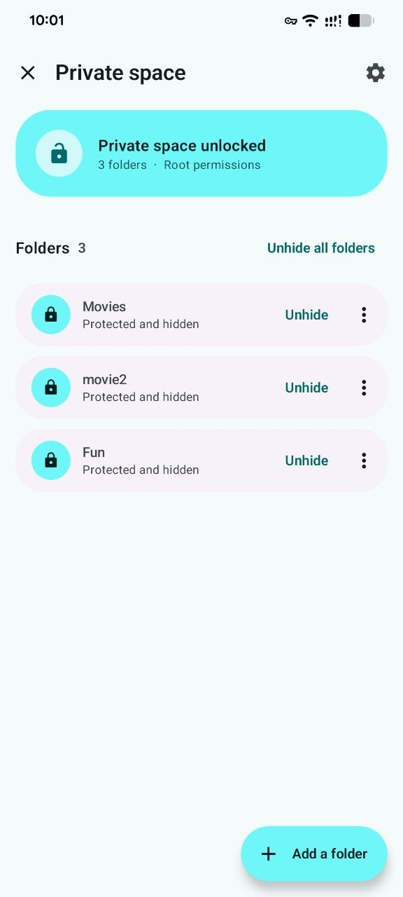
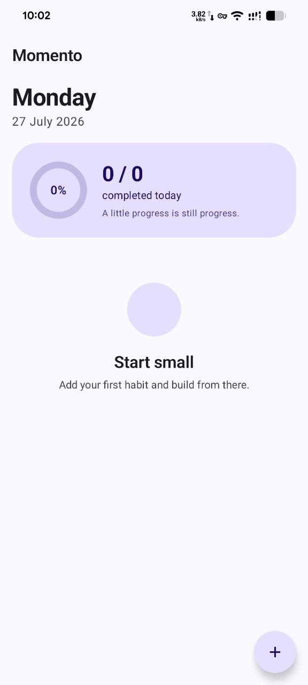
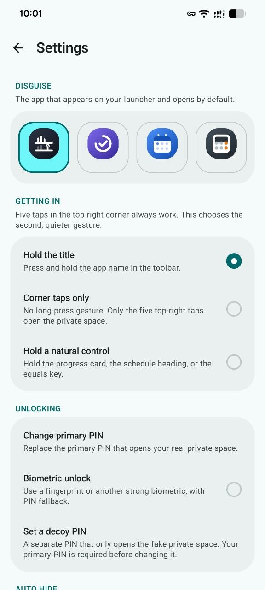
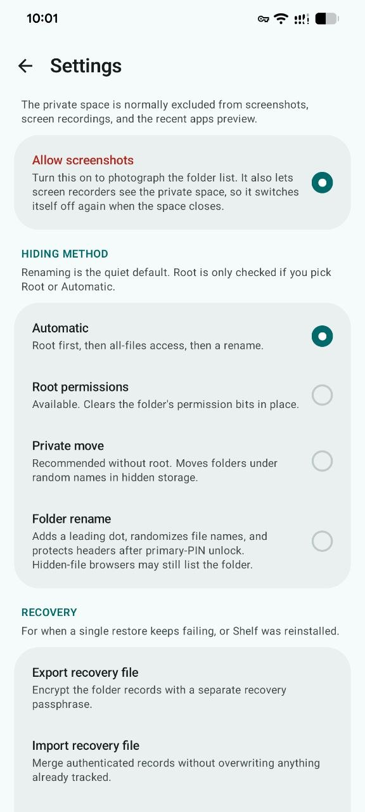

# Shelf

Shelf is an Android private-space utility that can present itself as **Momento**,
a habit tracker, or as a calendar or a calculator. All three decoys work as
ordinary local apps. Shelf hides folders instantly, whatever their size, without
sending data off the device — it holds no network permission at all. Root
improves folder hiding, but is optional.

## Screenshots

| Private space | Momento | Settings | Hiding and recovery |
| --- | --- | --- | --- |
|  |  |  |  |

## Installing

Android 11 or newer. Signed APKs are attached to each
[release](https://github.com/melastore/shelf/releases). Shelf is not on Google
Play, and because it cannot reach the network it will never update itself;
new versions have to be installed by hand.

Every release is signed with the same key.

Signing certificate SHA-256: `c0a840767117551defe6282499cf23a10c586a42da67a8bb4f038ef297d6a405`

## Using the private space

Five taps in the top-right corner always open the credential prompt. Settings adds
a second, quieter gesture: a long press on the decoy title (the default), or a
long press on a natural decoy control. Access uses whichever credential you chose
at setup: a 4–12 digit **PIN** on an in-app keypad, a **password**, or a 3×3
**pattern**. **Settings → Credentials** switches between them, which asks for the
old credential and then a new one in the new form. Strong biometric unlock can be
enabled once a credential is set; it always opens the real space, while the
credential prompt accepts either of your two credentials.

One **Auto hide** setting controls both closing the private UI and putting exposed
folders back out of sight: **After screen off**, **Immediately** when Shelf leaves
the foreground, or **Never**. An optional quiet notification, carrying the
disguise's own name and nothing about a private space, offers the same emergency
hide on demand. That notification stays up for as long as any folder is unhidden,
including after the app is closed, and its action works whether or not the app is
still running. Hiding runs as a foreground operation until filename, header, and
folder protection finish; interrupted journal entries are verified against the
real folder state and safely retried.

From inside the decoy space, the same five taps in the top-right corner open the
credential prompt again: the primary PIN or a biometric switches straight to the
real space, with no need to close the decoy first.

When biometric unlock is enabled, Shelf keeps a copy of the primary credential
encrypted by a non-exportable Android Keystore key that requires a strong-biometric
match for every use. This lets a fingerprint-opened session restore protected
headers and filenames without prompting again. Changing the credential or the
enrolled biometrics deletes that encrypted copy and turns biometric unlock off.

An optional **second credential** opens a private space that looks and behaves
like the real one and holds nothing that matters — the one to give up if you are
ever made to hand a credential over. Nothing in the app names it as such on any
screen someone could be made to show. Its use is recorded, and the real space
reports it on your next unlock. Changing how you unlock removes it, because a
second credential in the old form cannot be typed into the new prompt.

The private space and the credential prompt are excluded from screenshots, screen
recordings, and the recent apps preview. **Settings → Screen capture** lifts that
for the folder list when you want a picture of it. It never covers the keypad,
and because it is held in memory rather than saved, closing the private space
puts the protection back.

The selected decoy changes its launcher label and icon. Calendar events and
habits stay on-device, and the calculator performs ordinary chained arithmetic.

## The folder list

A folder added to the private space stays on the list whether or not it is
hidden, so putting it back out of sight later is one tap rather than another trip
through the folder picker. One control at the top of the list moves all of them
at once: **Unhide all folders** while any are hidden, **Hide all folders** once
they are all in the open. Each row does the same for itself. The list is
convenience only — [Journal](app/src/main/kotlin/io/github/melastore/shelf/data/Journal.kt)
remains the sole record of how a folder was hidden, so losing the list costs a
list, not a folder.

The quiet default is SAF. In Settings, the user can explicitly select root,
all-files, or automatic strongest-method selection:

- **Root:** randomizes file names, protects file headers, then clears permission bits on
  `/data/media/<user>` after recording the original mode and owner.
- **All-files access:** randomizes file names, protects file headers, then moves the folder under random
  container and payload names in a persistent `.shelf` directory on the same
  volume. The move is instant and survives uninstalling the app.
- **Storage Access Framework:** randomizes file names, protects file headers, then renames the folder
  with a leading dot. File managers configured to show hidden files can list the
  folder, but they see only opaque file identifiers; ordinary previews and file
  opening fail while it is hidden.

Header protection encrypts the first 64 KiB of every non-empty file with AES-GCM
and appends authenticated recovery data before overwriting anything. Its cost is
fixed per file rather than proportional to file size. The primary credential is
available only while the real private space is open, whether it was recovered by
a successful biometric match or entered directly.

Filename protection replaces every file name with a random `sfn_…` identifier.
The original relative names are stored only in an AES-GCM authenticated manifest
encrypted with the primary PIN. The manifest is synced before the first rename,
and restore can safely resume after interruption. Directory names are not changed.

Every operation is journalled before the folder is changed. Records are written
through a synced temporary file, and the last valid generation is retained. Root
and all-files hides also leave a small recovery marker with the folder so Shelf
can rebuild an empty journal after reinstalling or clearing app data.

**Settings → Recovery → Unhide everything** scans for folders Shelf hid but no
longer tracks, then restores every folder in one pass. Anything it cannot reach
is reported and left untouched. A single stuck record can also be dropped from
the row's menu; that removes the record only, never the folder.

Recovery also includes a read-only health check and a manual SAF route: choose
the parent of a dot-renamed folder, confirm the original name, and Shelf commits
a recovery record before renaming it. Recovery records can be exported as an
AES-GCM authenticated file protected by a separate passphrase of at least 12
characters. Imports validate paths and merge without replacing existing records.

## What it does not do

Shelf does not provide full-file encryption. Data beyond each protected header
remains plaintext on disk and can be recovered with forensic tools. Original
file names may also survive in filesystem, media-index, backup, or app caches.
Random names and protected headers stop ordinary browsing and previews, but
Shelf is not intended to resist a determined attacker with physical or root access.

A four-digit PIN is convenient but has only 10,000 combinations. Shelf slows
repeated in-app attempts, but a longer PIN is recommended and app-private
credential data is not designed to resist an attacker with root access.

## Building

    ./gradlew assembleDebug

Requires JDK 17 and Android SDK platform 36. The release build has no network,
analytics, advertising, or proprietary runtime dependency.

### Signing a direct release

Create a private keystore, copy `keystore.properties.example` to
`keystore.properties`, and fill in its four values. Both the properties file
and common keystore formats are ignored by Git. Then run:

    ./gradlew clean assembleRelease

The signed APK is written to `app/build/outputs/apk/release/app-release.apk`.
Keep the keystore and its password backed up: future direct-install updates
must be signed with the same key.

## Acknowledgements

Shelf's configurable camouflage was inspired by the public ideas in
[Amarok-Hider](https://github.com/deltazefiro/Amarok-Hider). Shelf's Compose UI,
credential handling, storage journal, and recovery format are independent.

## License

GPL-3.0-or-later. See [LICENSE](LICENSE).
